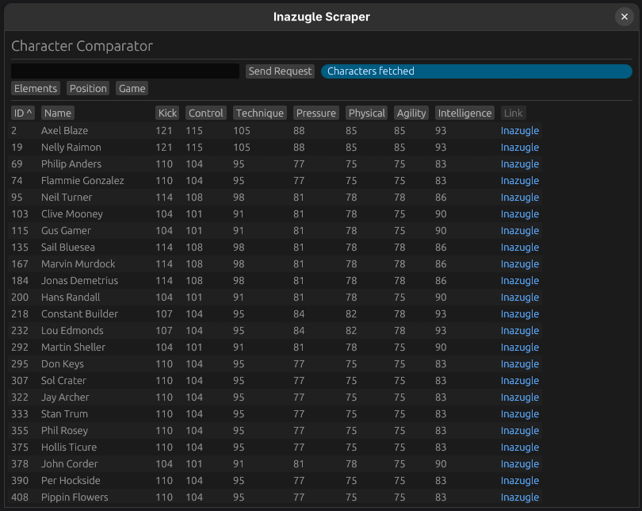

# Inazugle Scraper

This tool aims at getting the data from the [Inazugle Website](https://zukan.inazuma.jp/en/). This website is the official database for information on [Inazuma Eleven Victory Road](https://www.inazuma.jp/victory-road/en/). However, the website doesn't provide a convenient way to go through the stats of different characters and compare them. This tool solves that.

## Features

- Parametrized queries to the website for maximum flexibility
- Parallelized fetching of the data for best performance. Note: to respect the work that was put into making the website and to not cause them trouble, the number of parallel queries is limited to 20. This doesn't affect performance much, but is something to be aware of.
- Local caching of the data: once the tool has fetched the data once, it doesn't need to fetch it again and can immediatly get it from the local database.
- Table displaying of the characters and sorting

## Future work

- [ ] Making the UI prettier
- [ ] Fully local search using only data from the cache
- [ ] Collaboration with other developpers to create a technique database